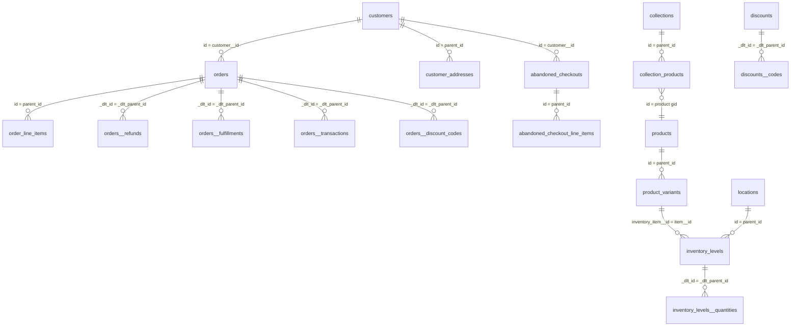

# apireference — Shopify API と raw データの関係

Shopify Admin GraphQL API のリソースが、どのように `raw` スキーマのテーブルへ落ちるかをまとめる。
API 側のリソース関係そのものは [`shopify-data-model.md`](shopify-data-model.md) を参照。

- **API リソースの関係 (ER)** → [`shopify-data-model.md`](shopify-data-model.md)
- **raw テーブルの定義 (列レベル)** → [`../raw_source_tables/`](../raw_source_tables/)
- **抽出実装** → [`../../dataload/`](../../dataload/)

## 取得方式 (API → raw)

`dataload/` の dlt パイプラインが Admin GraphQL API を叩き、`raw` スキーマへロードする。方式は3つ。

| 方式 | 対象 | 仕組み |
|---|---|---|
| **Bulk Operations** | orders / products / customers / collections / abandoned_checkouts / inventory_levels | 1クエリでオブジェクトグラフを非同期エクスポート。結果 JSONL の各ノードを gid の型で振り分ける |
| **inline list (Bulk 派生)** | orders__refunds / orders__fulfillments / orders__transactions / *__discount_codes / *__tags 等 | コネクションでない**リスト型フィールド**は親ノードに inline 展開され、dlt が `親__フィールド` の子テーブルへ正規化する |
| **ページング** | discounts / locations | 通常のカーソルページング (`first` / `after` / `query`) |

### Bulk のノード分割と親子キー

Bulk は **コネクション** (`edges { node { … } }`) のノードを1行ずつ JSONL に書き出す。ネストした
コネクションのノードには `__parentId` が付与され、これを dlt が **`parent_id`** に改名して保持する。

- 例: `order_line_items.parent_id` = 親 `orders.id` (どちらも gid)。

一方、**コネクションでないリスト**(`[Refund!]!` など)は親ノードに埋め込まれて返り、dlt の正規化で
子テーブル `orders__refunds` 等になる。この場合の結合キーは gid ではなく dlt 内部行 ID:

- 例: `orders__refunds._dlt_parent_id` = 親 `orders._dlt_id`。

> Bulk 制約: 1クエリで connection 最大5・ネスト最大2階層・コネクションのノードは Node(id) 必須。
> 詳細は [`../../dataload/README.md`](../../dataload/README.md)。

### 差分取得とバックフィル

既定は**差分取得**(前回の高水位以降のみを Shopify 側フィルタで取得し `merge`)。過去分は
**手動バックフィル**(全期間 / 期間指定)。在庫レベルは差分キーが無いため毎回全件 `replace`。

### gid の数値化 (staging 以降)

raw の ID は Shopify の global ID (`gid://shopify/<Type>/<n>`) 文字列。`staging` 層で PK・FK の
gid から ID 部分を**文字列 (数値の文字列。例 `"7648543047976"`)** として抽出する(`parse_gid_id` マクロ)。
`inventory_level_id` だけは複合 gid(`?inventory_item_id=…`)で ID 単体が一意にならないため gid のまま保持する。

## raw テーブル ↔ API オブジェクト 対応

| raw テーブル | API オブジェクト / コネクション | 取得方式 | 親 (結合キー) |
|---|---|---|---|
| orders | `Order` (`orders`) | Bulk | — |
| order_line_items | `LineItem` (`order.lineItems`) | Bulk | orders (`parent_id`→`id`) |
| orders__refunds | `Refund` (`order.refunds`) | inline list | orders (`_dlt_parent_id`→`_dlt_id`) |
| orders__fulfillments | `Fulfillment` (`order.fulfillments`) | inline list | orders (`_dlt_parent_id`→`_dlt_id`) |
| orders__transactions | `OrderTransaction` (`order.transactions`) | inline list | orders (`_dlt_parent_id`→`_dlt_id`) |
| orders__discount_codes | `order.discountCodes` (`[String!]`) | inline list | orders (`_dlt_parent_id`→`_dlt_id`) |
| products | `Product` (`products`) | Bulk | — |
| product_variants | `ProductVariant` (`product.variants`) | Bulk | products (`parent_id`→`id`) |
| customers | `Customer` (`customers`) | Bulk | — |
| customer_addresses | `MailingAddress` (`customer.addressesV2`) | Bulk | customers (`parent_id`→`id`) |
| collections | `Collection` (`collections`) | Bulk | — |
| collection_products | `Product` (`collection.products`) | Bulk | collections (`parent_id`→`id`) |
| abandoned_checkouts | `AbandonedCheckout` (`abandonedCheckouts`) | Bulk | — |
| abandoned_checkout_line_items | `AbandonedCheckoutLineItem` (`abandonedCheckout.lineItems`) | Bulk | abandoned_checkouts (`parent_id`→`id`) |
| discounts | `DiscountNode` (`discountNodes`) | ページング | — |
| discounts__codes | `DiscountRedeemCode` (`…​.codes`) | ページング (子) | discounts (`_dlt_parent_id`→`_dlt_id`) |
| locations | `Location` (`locations`) | ページング | — |
| inventory_levels | `InventoryLevel` (`location.inventoryLevels`) | Bulk | locations (`parent_id`→`id`)、`item__id`→product_variants |
| inventory_levels__quantities | `InventoryQuantity` (`inventoryLevel.quantities`) | inline list | inventory_levels (`_dlt_parent_id`→`_dlt_id`) |

## raw 層 ER (結合キー)

gid 結合 (`parent_id`→`id`) と dlt 内部結合 (`_dlt_parent_id`→`_dlt_id`) が混在する。

> 注: `collection_products` は id=商品 gid・parent_id=コレクション gid の連結テーブル。
> `inventory_levels` は location (`parent_id`) と inventory item (`item__id`) の2つを親に持つ。
