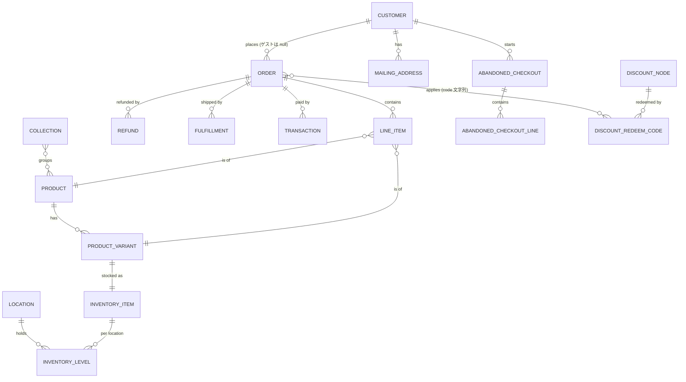

# Shopify Admin API データモデル (リソース関係)

Shopify Admin GraphQL API の主要リソースと、その関係を解説する。
本基盤が `raw` に取り込むオブジェクトを中心に扱う。API バージョンは **2026-07**。

raw テーブルとの対応・取得方式は [`README.md`](README.md) を参照。

> 本ページのフィールド名は **API のまま (camelCase)** で示す。raw では snake_case に
> なり、ネストは `__` で平坦化される (例 `totalPriceSet.shopMoney.amount` →
> `total_price_set__shop_money__amount`)。列レベルの最終形は
> [`../raw_source_tables/`](../raw_source_tables/) を参照。
> 例に出す金額はすべて `MoneyBag` (`{ shopMoney { amount currencyCode } }`) で、
> `amount` は文字列で返る点に注意 (staging で `double` 化)。

## コア ER 図

> カーソル記法: `||` = ちょうど1、`o{` = 0以上(多)、`|{` = 1以上。
> `}o--o{` は多対多。実線は必須リレーション、`o` 側は任意 (null 可)。

## Shopify の運用フローと考え方

Shopify のデータモデルは、ストアの**実運用の流れ**をほぼそのまま写している。各オブジェクトが
管理画面 (Admin) のどの操作に対応するかを押さえると、テーブル設計の意図が読みやすくなる。

### ストア運営のライフサイクル

1. **商品を登録する** (Product / ProductVariant)
   管理画面「商品」で商品を作り、色・サイズなどの選択肢 (options) の組み合わせからバリアントが
   生成される。1商品につき最低1バリアント (既定バリアント) が必ず存在する。SKU・バーコード (JAN)・
   価格・原価は**バリアント単位**で持つ。→ 分析の最小単位は「商品」ではなく「バリアント」になる。

2. **在庫を置く** (InventoryItem / InventoryLevel / Location)
   各バリアントは1つの InventoryItem に対応し、その在庫は Location (倉庫・店舗) ごとに
   InventoryLevel として分かれて記録される。在庫追跡 (`tracked`) を切ると数量は管理されない。
   `available` (販売可能) = `on_hand` (実在庫) − `committed` (引当済) が基本の関係。

3. **商品を束ねる・公開する** (Collection)
   コレクションで商品をグルーピングし販売導線を作る。**手動**コレクション (商品を直接指定) と
   **自動**コレクション (タグ・価格などのルールで自動所属) がある。1商品は複数コレクションに属し得る。

4. **集客し、カゴに入る** (AbandonedCheckout)
   チェックアウトを開始したが未完了のものが放棄チェックアウト (カゴ落ち)。完了すると Order に
   変わり `completedAt` が入る。カゴ落ち→復帰の分析やリカバリーメールの母数になる。

5. **注文が成立する** (Order / LineItem)
   チェックアウト完了・POS 会計・下書き注文 (draft order) の確定などで Order が生まれる。
   購入された各行が LineItem。注文は「支払」と「配送」の**2軸の状態**
   (`displayFinancialStatus` / `displayFulfillmentStatus`) を独立して進む。

6. **支払を処理する** (OrderTransaction)
   決済は authorization (与信) → capture (確定) の2段階が基本で、両方を一度に行うのが sale。
   返金は refund、与信取り消しは void。1注文に複数の取引がぶら下がる。

7. **出荷する** (Fulfillment)
   在庫を引き当てて出荷する。追跡番号・配達状況を持つ。複数ロケーションからの分割出荷では
   1注文に複数 Fulfillment が付く。

8. **返品・返金する** (Refund)
   全額/一部の返金があり、注文の `current*` 金額と `totalRefundedSet` に反映される。
   受注時の `total*` は不変なので、実績は必ず `current*` 系で見る。

9. **顧客として蓄積する** (Customer)
   注文はゲスト (customer=null) でも成立する。会員は Customer に紐づき、`amountSpent` /
   `numberOfOrders` は Shopify 側が集計した生涯値。メール配信可否は `marketingState` で管理する。

### モデリング上の考え方 (分析での勘所)

- **状態は2軸で持つ**: 支払 (financial) と配送 (fulfillment) は独立。「入金済みだが未出荷」も普通に起きる。
  片方の状態だけで「完了」を判定しないこと。
- **`total*` と `current*` を混同しない**: 前者は受注時のスナップショット、後者は返品・注文編集の
  反映後。売上・粗利などの KPI は `current*` / `net*` 系を使う。
- **金額は文字列で返る**: API は `MoneyBag.shopMoney.amount` を文字列で返す。丸めや通貨を保ったまま
  取り込み、staging で `double` 化する。通貨は原則ストア通貨 (`shopMoney`)。
- **タグは運用の自由記述**: merchant がセグメント抽出や自動化 (Shopify Flow) のために自由に付ける。
  scalar リストなので子テーブルに割れる。表記ゆれ (全角/半角・大文字小文字) が起きやすく、
  集計前の正規化を検討する。
- **gid が正の ID**: すべての ID は `gid://shopify/<Type>/<n>`。`legacyResourceId` は REST 時代の
  数値 ID で gid 末尾の数値に一致する。本基盤は gid から数値部分を文字列抽出して結合キーにする。
- **削除・非所属化に注意**: 商品削除で LineItem の `product` / `variant` は null になり得る。
  差分 (merge) 取得では親から外れた子行が残るため、厳密な整合はバックフィルで取り直す。
- **60日の壁**: 注文は既定で過去60日しか参照できない。全期間取得には `read_all_orders` スコープが要る。

## 主なリソース

各リソースの主要フィールドを「説明」と「例」つきで示す。**太字**は分析でよく使う列。

### Order (注文) — [doc](https://shopify.dev/docs/api/admin-graphql/latest/objects/Order)

購入の中心。チェックアウト → 支払 → フルフィルメントのライフサイクルを表す。金額系は
`total*` (受注時) と `current*` (返品・編集の反映後) の2系統があり、実績は `current*` を使う。

| フィールド (API) | 型 | 説明 | 例 |
|---|---|---|---|
| **id** | ID! | 注文の global ID | `gid://shopify/Order/450789469` |
| **name** | String | 表示用の注文番号 (接頭辞つき) | `#1001` |
| number | Int | ストア内の連番 | `1001` |
| confirmationNumber | String | 顧客向け確認番号 | `XPAV3DHNU` |
| **createdAt** / updatedAt | DateTime | 作成 / 最終更新 (ISO8601, UTC) | `2026-07-01T09:12:00Z` |
| **processedAt** | DateTime | 会計上の注文成立時刻。分析の基準日に使う | `2026-07-01T09:12:00Z` |
| cancelledAt / cancelReason | DateTime / enum | キャンセル時刻と理由 | `null` / `CUSTOMER` |
| **displayFinancialStatus** | enum | 支払状態 | `PAID` / `PENDING` / `REFUNDED` / `PARTIALLY_REFUNDED` |
| **displayFulfillmentStatus** | enum | 配送状態 | `FULFILLED` / `UNFULFILLED` / `PARTIALLY_FULFILLED` |
| currencyCode | enum | 注文通貨 | `JPY` |
| taxesIncluded / taxExempt | Boolean | 税込価格か / 免税注文か | `true` / `false` |
| test | Boolean | テスト注文か (集計から除外) | `false` |
| email / phone | String | 連絡先 | `taro@example.com` |
| customerLocale | String | 顧客の言語 | `ja` |
| sourceName | String | 発生チャネル | `web` / `pos` / `shopify_draft_order` |
| **tags** | [String!] | 運用タグ (子テーブル `orders__tags`) | `["repeat", "gift"]` |
| discountCode / discountCodes | String / [String!] | 適用割引コード | `"SUMMER10"` / `["SUMMER10"]` |
| paymentGatewayNames | [String!] | 決済ゲートウェイ | `["shopify_payments"]` |
| **totalPriceSet** | MoneyBag | 受注時の総額 (税・送料込) | `{ shopMoney: { amount: "3300.00", currencyCode: "JPY" } }` |
| subtotalPriceSet | MoneyBag | 商品小計 (割引後・税送料前) | `"3000.00"` |
| totalTaxSet / totalShippingPriceSet | MoneyBag | 税額 / 送料 | `"300.00"` / `"500.00"` |
| totalDiscountsSet | MoneyBag | 割引総額 | `"200.00"` |
| **totalRefundedSet** | MoneyBag | 返金総額 | `"0.00"` |
| **currentTotalPriceSet** | MoneyBag | 返品・編集反映後の総額 (実績) | `"3300.00"` |
| netPaymentSet | MoneyBag | 実入金 (総額 − 返金) | `"3300.00"` |

> 既定では過去60日以内の注文のみ参照可。全期間は `read_all_orders` スコープが必要。

**実務メモ**: 注文は online store のチェックアウトだけでなく、実店舗の POS 会計、Admin で作る
下書き注文 (draft order) の確定、外部アプリ経由でも生まれる (`sourceName` で判別)。
Bogus Gateway 等で作ったテスト注文は `test = true` になるので集計から除外する。注文編集
(商品追加・数量変更) や部分キャンセルをすると受注時の `total*` はそのままで `current*` だけが動く。
「売れた瞬間」を表すのは `createdAt` ではなく会計成立の `processedAt`。日次売上はこちらで束ねる。

### LineItem (注文明細) — [doc](https://shopify.dev/docs/api/admin-graphql/latest/objects/LineItem)

注文内の1商品行。粒度は (注文 × 明細)。`product` / `variant` は削除済み商品で null になり得る。

| フィールド (API) | 型 | 説明 | 例 |
|---|---|---|---|
| **id** | ID! | 明細の global ID | `gid://shopify/LineItem/112233` |
| title | String | 明細表示名 (商品名) | `Tシャツ (白 / M)` |
| **quantity** | Int | 購入数量 | `2` |
| sku | String | 在庫管理コード | `TSHIRT-WH-M` |
| vendor | String | 仕入先/ブランド | `ACME` |
| **product** / **variant** | Product / ProductVariant | 参照先商品・バリアント (id のみ取得) | `{ id: gid://shopify/Product/900 }` |
| **originalUnitPriceSet** | MoneyBag | 割引前の単価 | `"1500.00"` |
| discountedUnitPriceSet | MoneyBag | 明細割引を按分した実質単価 | `"1350.00"` |
| totalDiscountSet | MoneyBag | この明細への割引額合計 | `"300.00"` |

**実務メモ**: 注文レベルの割引 (クーポン等) は各明細へ按分されて `discountedUnitPriceSet` /
`totalDiscountSet` に落ちる。純売上を明細粒度で出すなら「(単価 × 数量) − 明細割引」を積み上げる。
原価は LineItem に持たないため、粗利は `variant.inventoryItem.unitCost` を結合して算出する
(本基盤では `fct_order_lines` がこの結合を担う)。返品分は Refund 側で相殺する。

### Refund / Fulfillment / OrderTransaction (注文の子)

いずれも Order のリスト型フィールド (コネクションではない)。raw では inline list 子テーブル。

**Refund (返金)** — [doc](https://shopify.dev/docs/api/admin-graphql/latest/objects/Refund)

| フィールド (API) | 型 | 説明 | 例 |
|---|---|---|---|
| id | ID! | 返金の global ID | `gid://shopify/Refund/778` |
| createdAt / processedAt | DateTime | 返金の作成 / 会計処理時刻 | `2026-07-05T10:00:00Z` |
| note | String | 返金メモ | `サイズ不一致のため` |
| **totalRefundedSet** | MoneyBag | 返金額 | `"1350.00"` |

**Fulfillment (出荷)** — [doc](https://shopify.dev/docs/api/admin-graphql/latest/objects/Fulfillment)

| フィールド (API) | 型 | 説明 | 例 |
|---|---|---|---|
| id | ID! | 出荷の global ID | `gid://shopify/Fulfillment/551` |
| **status** / displayStatus | enum | 出荷状態 | `SUCCESS` / `DELIVERED` |
| estimatedDeliveryAt / deliveredAt | DateTime | 配達予定 / 実配達時刻 | `2026-07-08T00:00:00Z` |
| inTransitAt | DateTime | 輸送開始時刻 | `2026-07-06T02:00:00Z` |
| totalQuantity | Int | 出荷点数 | `2` |

**OrderTransaction (決済取引)** — [doc](https://shopify.dev/docs/api/admin-graphql/latest/objects/OrderTransaction)

| フィールド (API) | 型 | 説明 | 例 |
|---|---|---|---|
| id | ID! | 取引の global ID | `gid://shopify/OrderTransaction/993` |
| **kind** | enum | 取引種別 | `SALE` / `AUTHORIZATION` / `CAPTURE` / `REFUND` / `VOID` |
| **status** | enum | 取引結果 | `SUCCESS` / `FAILURE` / `PENDING` |
| gateway | String | 決済ゲートウェイ | `shopify_payments` |
| **amountSet** | MoneyBag | 取引金額 | `"3300.00"` |

**実務メモ**: 手動キャプチャ設定のストアでは authorization (与信) だけ先に立ち、出荷時に
capture (確定) する運用がある。実入金は `SUCCESS` かつ `sale` / `capture` の合計で見る
(`authorization` は入金ではない)。決済手数料は取引には含まれないため、正確な入金は Shopify Payments の
Payouts など別ソースで補完する。`gateway` 別に売上を割ると決済手段のミックスが分かる。

### Customer (顧客) — [doc](https://shopify.dev/docs/api/admin-graphql/latest/objects/Customer)

顧客マスタ。メール配信同意は `defaultEmailAddress.marketingState` に入る。
`addressesV2` で複数の **MailingAddress** を持つ。

| フィールド (API) | 型 | 説明 | 例 |
|---|---|---|---|
| **id** | ID! | 顧客の global ID | `gid://shopify/Customer/207119551` |
| firstName / lastName | String | 名 / 姓 | `太郎` / `山田` |
| **defaultEmailAddress.emailAddress** | String | メールアドレス | `taro@example.com` |
| **defaultEmailAddress.marketingState** | enum | メール配信同意状態 | `SUBSCRIBED` / `NOT_SUBSCRIBED` / `UNSUBSCRIBED` |
| defaultEmailAddress.marketingOptInLevel | enum | 同意レベル | `SINGLE_OPT_IN` / `CONFIRMED_OPT_IN` |
| defaultPhoneNumber.phoneNumber | String | 電話番号 | `+81901234567` |
| **numberOfOrders** | Int | 注文回数 (API 集計) | `5` |
| **amountSpent** | MoneyBag | 生涯購入額 | `"42000.00"` |
| state | enum | 顧客アカウント状態 | `ENABLED` / `DISABLED` / `INVITED` |
| taxExempt | Boolean | 免税顧客か | `false` |
| locale | String | 言語/地域 | `ja` |
| lifetimeDuration | String | 登録からの経過 | `about 2 years` |
| verifiedEmail | Boolean | メール確認済みか | `true` |
| **tags** | [String!] | 顧客タグ (子テーブル `customers__tags`) | `["vip", "wholesale"]` |
| defaultAddress | MailingAddress | 既定住所 (city/province/country/zip) | `{ city: "渋谷区", country: "Japan" }` |

**実務メモ**: `amountSpent` / `numberOfOrders` は Shopify が集計した生涯値で、キャンセルや
テスト注文の扱いが自前集計とずれることがある。厳密な LTV は `fct_orders` から再計算するのが安全。
メール配信は改正個人情報保護法/GDPR の観点から `marketingState = SUBSCRIBED` のみを配信母数にする
(オプトイン取得済みでも解除は尊重)。顧客はゲスト購入だと作られないため、注文の顧客紐付けは欠損があり得る。
同一人物が複数アカウントになる名寄せ問題もあるため、分析ではメール等での統合を検討する。

### Product / ProductVariant / InventoryItem

**Product (商品)** — [doc](https://shopify.dev/docs/api/admin-graphql/latest/objects/Product)

| フィールド (API) | 型 | 説明 | 例 |
|---|---|---|---|
| **id** | ID! | 商品の global ID | `gid://shopify/Product/900` |
| **title** / handle | String | 商品名 / URL スラッグ | `Tシャツ` / `t-shirt` |
| productType | String | 商品タイプ (自由入力) | `アパレル` |
| vendor | String | ブランド / 仕入先 | `ACME` |
| **status** | enum | 公開状態 | `ACTIVE` / `ARCHIVED` / `DRAFT` |
| category | TaxonomyCategory | 標準タクソノミ (id/name/fullName) | `{ name: "T-Shirts" }` |
| **tags** | [String!] | 商品タグ (子テーブル `products__tags`) | `["新作", "SALE"]` |
| totalInventory | Int | 全ロケーション合計在庫 | `120` |
| variantsCount.count | Int | バリアント数 | `3` |
| publishedAt | DateTime | 公開日時 | `2026-06-01T00:00:00Z` |

**ProductVariant (バリアント)** — [doc](https://shopify.dev/docs/api/admin-graphql/latest/objects/ProductVariant)

| フィールド (API) | 型 | 説明 | 例 |
|---|---|---|---|
| **id** | ID! | バリアントの global ID | `gid://shopify/ProductVariant/9011` |
| title / displayName | String | バリアント名 / 商品+バリアント名 | `白 / M` / `Tシャツ - 白 / M` |
| **sku** | String | 在庫管理コード | `TSHIRT-WH-M` |
| **barcode** | String | バーコード (**JAN** / EAN / UPC 等) | `4901234567894` |
| **price** / compareAtPrice | Money | 販売価格 / 参考価格 (文字列) | `"1500.00"` / `"2000.00"` |
| inventoryQuantity | Int | 在庫数 | `40` |
| selectedOptions | [SelectedOption] | 選択オプション (name/value) | `[{ name: "色", value: "白" }]` |
| inventoryItem.id | ID! | 在庫アイテム参照 (在庫レベルとの結合キー) | `gid://shopify/InventoryItem/70011` |

**InventoryItem (在庫アイテム)** — [doc](https://shopify.dev/docs/api/admin-graphql/latest/objects/InventoryItem)

| フィールド (API) | 型 | 説明 | 例 |
|---|---|---|---|
| id | ID! | 在庫アイテムの global ID | `gid://shopify/InventoryItem/70011` |
| **unitCost** | MoneyV2 | 原価 (粗利計算に使用) | `{ amount: "600.00", currencyCode: "JPY" }` |
| tracked | Boolean | 在庫追跡が有効か | `true` |
| requiresShipping | Boolean | 配送が必要か | `true` |
| measurement.weight | Weight | 重量 (value/unit) | `{ value: 180, unit: GRAMS }` |

**実務メモ**: 商品はまず options (色・サイズ等) を定義し、その組み合わせがバリアントになる。
オプション無しの商品にも既定バリアント (`Default Title`) が1つでき、`hasOnlyDefaultVariant = true`。
SKU・バーコード・価格・原価はすべてバリアント/InventoryItem 側にあるため、商品粒度の集計では
「代表値」か「一覧 (本基盤の `sku_list` / `jan_list`)」に畳む。`status` は ACTIVE のみが販売中で、
DRAFT/ARCHIVED は売り場に出ない。バリアント数には上限があり、多いと Bulk 取得が重くなる。

### Location / InventoryLevel

**Location (拠点)** — [doc](https://shopify.dev/docs/api/admin-graphql/latest/objects/Location)

| フィールド (API) | 型 | 説明 | 例 |
|---|---|---|---|
| id | ID! | 拠点の global ID | `gid://shopify/Location/501` |
| name | String | 拠点名 | `東京倉庫` |
| isActive | Boolean | 有効か | `true` |
| fulfillsOnlineOrders | Boolean | オンライン注文を引き当てるか | `true` |
| address | LocationAddress | 住所 (city/province/country/zip 等) | `{ city: "江東区", country: "Japan" }` |

**InventoryLevel (在庫レベル)** — [doc](https://shopify.dev/docs/api/admin-graphql/latest/objects/InventoryLevel)

| フィールド (API) | 型 | 説明 | 例 |
|---|---|---|---|
| id | ID! | 複合 global ID (`?inventory_item_id=…`)。ID 単体は非一意 | `gid://shopify/InventoryLevel/501?inventory_item_id=70011` |
| item.id | ID! | 在庫アイテム (バリアントと結合) | `gid://shopify/InventoryItem/70011` |
| **quantities** | [InventoryQuantity] | name/quantity のペア群 | `[{ name: "available", quantity: 40 }]` |

> `quantities` の name は `available` (販売可能) / `on_hand` (実在庫) /
> `committed` (引当済) / `incoming` (入荷予定)。

**実務メモ**: 在庫はロケーション×在庫アイテムの交点で持つため、同じバリアントでも倉庫が違えば別行。
店舗横断の在庫は `available` を合算する。注文が入ると `committed` が増え `available` が減る (`on_hand` は
出荷まで不変)。在庫追跡を切った商品 (`tracked = false`) は数量を持たず、常に販売可能として扱われる。
InventoryLevel の gid は複合キー (`?inventory_item_id=…`) で末尾数値だけでは一意にならない点に注意
(本基盤は gid を丸ごと保持する)。

### Collection (コレクション) — [doc](https://shopify.dev/docs/api/admin-graphql/latest/objects/Collection)

商品グルーピング。手動 (指定) と自動 (ルール) がある。`products` で多対多に **Product** を含む。

| フィールド (API) | 型 | 説明 | 例 |
|---|---|---|---|
| id | ID! | コレクションの global ID | `gid://shopify/Collection/301` |
| title / handle | String | 名称 / URL スラッグ | `夏コレクション` / `summer` |
| sortOrder | enum | 商品の並び順 | `BEST_SELLING` / `MANUAL` |
| productsCount.count | Int | 所属商品数 | `24` |
| products | ProductConnection | 所属商品 (id を取得) | `[{ id: gid://shopify/Product/900 }]` |

**実務メモ**: 手動コレクションは merchant が商品を明示追加し、自動 (スマート) コレクションは
「タグ = 新作」「価格 < 3000」などのルール (`ruleSet`) で所属が自動決定される。同じ商品が
複数コレクションに属するため、コレクション別売上を単純合計すると重複計上になる (按分か重複前提で扱う)。
`sortOrder` は売り場の並び順で、分析の意味は薄い。本基盤では所属を `product_collections` ブリッジに展開する。

### Discount (DiscountNode) / DiscountRedeemCode

**DiscountNode** — [doc](https://shopify.dev/docs/api/admin-graphql/latest/objects/DiscountNode)

コード割引・自動割引を統合するラッパ。`discount` に具象型のユニオンが入る。

| フィールド (API) | 型 | 説明 | 例 |
|---|---|---|---|
| id | ID! | 割引の global ID | `gid://shopify/DiscountNode/401` |
| discount.__typename | String | 具象型 | `DiscountCodeBasic` / `DiscountAutomaticBasic` |
| title | String | 割引名 | `夏の10%OFF` |
| status | enum | 状態 | `ACTIVE` / `EXPIRED` / `SCHEDULED` |
| startsAt / endsAt | DateTime | 有効期間 | `2026-07-01T00:00:00Z` / `2026-07-31T23:59:59Z` |
| asyncUsageCount | Int | 総利用回数 | `132` |
| customerGets.value | Union | 割引値 (percentage or amount) | `{ percentage: 0.1 }` |

**DiscountRedeemCode**: コード割引の実コード文字列と利用回数 (`code` / `asyncUsageCount`)。
注文には `discountCodes` (文字列) として適用される (直接の FK ではない)。例: `code = "SUMMER10"`。

**実務メモ**: DiscountNode は「コード割引 / 自動割引」×「値引き種別 (％/固定額/送料無料/BXGY)」の
組み合わせをユニオン型で束ねる。取り込み側はこのユニオンを平坦化して `discount_type` に種別を残す。
注文と割引は**コード文字列の一致でしか結べない**ため、割引×注文の分析はコードで突き合わせる
(同名コードの再利用や自動割引=コード無しに注意)。`asyncUsageCount` は集計に遅延があり得る。

### AbandonedCheckout (放棄チェックアウト) — [doc](https://shopify.dev/docs/api/admin-graphql/latest/objects/AbandonedCheckout)

未完了のチェックアウト (カゴ落ち)。`completedAt` が非 null なら後から購入=復帰。

| フィールド (API) | 型 | 説明 | 例 |
|---|---|---|---|
| id | ID! | チェックアウトの global ID | `gid://shopify/AbandonedCheckout/601` |
| abandonedCheckoutUrl | URL | 復帰用 URL | `https://shop.example/...` |
| createdAt / completedAt | DateTime | 開始 / 復帰時刻 (null=未復帰) | `2026-07-02T…` / `null` |
| totalPriceSet | MoneyBag | カゴ総額 | `"3300.00"` |
| customer | Customer | 顧客 (匿名は null) | `{ id: gid://shopify/Customer/207119551 }` |
| lineItems | AbandonedCheckoutLineItemConnection | カゴ内明細 | `[{ title: "Tシャツ", quantity: 1 }]` |

**実務メモ**: カゴ落ちは「チェックアウト開始 → 未完了」の状態。`completedAt` が入ると購入=復帰で、
その注文は Order 側にも現れる (二重計上に注意)。復帰率 = `completedAt` 非 null 件数 / 全放棄件数。
リカバリーメールの効果測定や、離脱の多い価格帯・商品の把握に使う。匿名カゴは `customer = null`。

## 関係の要点 (カーディナリティ)

| 親 | 子 | 関係 | 備考 |
|---|---|---|---|
| Customer | Order | 1 → 0..* | ゲスト注文は customer=null |
| Customer | 顧客タグ | 1 → 0..* | scalar リスト (`customers__tags`) |
| Order | LineItem | 1 → 1..* | |
| Order | Refund / Fulfillment / Transaction | 1 → 0..* | リスト型 (非コネクション) |
| Product | ProductVariant | 1 → 1..* | 最低1 (既定バリアント) |
| Product | 商品タグ | 1 → 0..* | scalar リスト (`products__tags`) |
| ProductVariant | InventoryItem | 1 → 1 | |
| InventoryItem | InventoryLevel | 1 → 0..* | ロケーションごと |
| Location | InventoryLevel | 1 → 0..* | |
| Collection | Product | 0..* ↔ 0..* | 多対多 (membership) |
| AbandonedCheckout | AbandonedCheckoutLineItem | 1 → 1..* | |
| Customer | MailingAddress | 1 → 0..* | defaultAddress が既定 |

## 補足

- **ID**: 全リソースの `id` は global ID (`gid://shopify/<Type>/<n>`)。本基盤の `staging` 以降は
  この gid から ID 部分を文字列で抽出する ([`README.md`](README.md) 参照)。
- **金額**: API は文字列 (`MoneyBag.shopMoney.amount`)。`staging` 以降で `double` に変換。
- **`legacyResourceId`**: REST Admin API 時代の数値 ID。gid の数値部分と一致する。
- **タグ**: `tags` は `[String!]`。dlt が子テーブル (`*__tags`, 値は `value` 列) に正規化し、
  staging でカンマ連結して `dim_customers` / `dim_products` に載せる。
