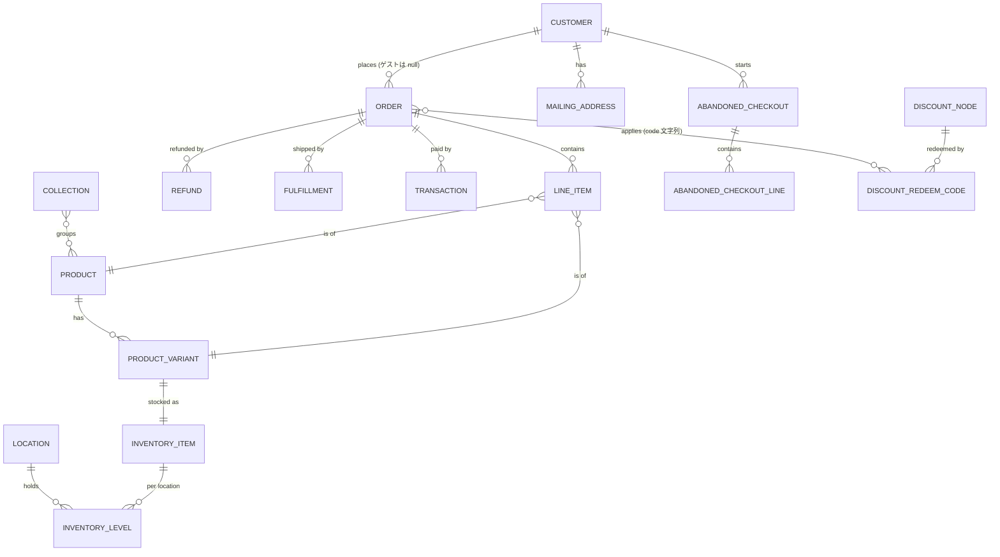

# Shopify Admin API データモデル (リソース関係)

Shopify Admin GraphQL API の主要リソースと、その関係を解説する。
本基盤が `raw` に取り込むオブジェクトを中心に扱う。API バージョンは **2026-07**。

raw テーブルとの対応・取得方式は [`README.md`](README.md) を参照。

## コア ER 図

> カーソル記法: `||` = ちょうど1、`o{` = 0以上(多)、`|{` = 1以上。
> `}o--o{` は多対多。実線は必須リレーション、`o` 側は任意 (null 可)。

## 主なリソース

### Order (注文) — [doc](https://shopify.dev/docs/api/admin-graphql/latest/objects/Order)
購入の中心。チェックアウト → 支払 → フルフィルメントのライフサイクルを表す。
- **主なフィールド**: `name`(#1001)、`displayFinancialStatus`(支払)、`displayFulfillmentStatus`(配送)、`totalPriceSet`/`subtotalPriceSet`/`totalRefundedSet` などの金額 (`current*` は返品反映後)、`processedAt`/`cancelledAt`。
- **関係**: `customer`(0..1、ゲスト注文は null)、`lineItems`(1..*)、`refunds`/`fulfillments`/`transactions`(0..*)、`discountCodes`(適用コード文字列)。
- 既定では過去60日以内のみ参照可。全期間は `read_all_orders` スコープが必要。

### LineItem (注文明細) — [doc](https://shopify.dev/docs/api/admin-graphql/latest/objects/LineItem)
注文内の1商品行。`quantity`、`sku`、`originalUnitPriceSet`/`discountedUnitPriceSet`、`totalDiscountSet`。
`product`・`variant` を参照 (商品/バリアント削除時は null になり得る)。

### Refund / Fulfillment / OrderTransaction (注文の子)
いずれも Order のリスト型フィールド (コネクションではない)。
- **Refund** [doc](https://shopify.dev/docs/api/admin-graphql/latest/objects/Refund): 返金。`totalRefundedSet`、`createdAt`/`processedAt`、`note`。注文粒度の `totalRefundedSet` を裏付ける。
- **Fulfillment** [doc](https://shopify.dev/docs/api/admin-graphql/latest/objects/Fulfillment): 出荷。`status`/`displayStatus`、`estimatedDeliveryAt`/`deliveredAt`、`totalQuantity`、`trackingInfo`。
- **OrderTransaction** [doc](https://shopify.dev/docs/api/admin-graphql/latest/objects/OrderTransaction): 決済取引。`kind`(authorization/capture/sale/refund/void)、`status`、`gateway`、`amountSet`。

### Customer (顧客) — [doc](https://shopify.dev/docs/api/admin-graphql/latest/objects/Customer)
`defaultEmailAddress`(メール配信同意 `marketingState` を含む)、`amountSpent`(生涯購入額)、`numberOfOrders`、`taxExempt`、`locale`。
`addressesV2` で複数の **MailingAddress** を持つ (`defaultAddress` が既定)。

### Product / ProductVariant / InventoryItem
- **Product** [doc](https://shopify.dev/docs/api/admin-graphql/latest/objects/Product): `title`、`handle`、`productType`、`status`、`category`(タクソノミ)、`variantsCount`。1..* の **ProductVariant** を持つ。
- **ProductVariant** [doc](https://shopify.dev/docs/api/admin-graphql/latest/objects/ProductVariant): `sku`、`price`/`compareAtPrice`、`inventoryQuantity`、`selectedOptions`。1..1 の **InventoryItem** に対応。
- **InventoryItem** [doc](https://shopify.dev/docs/api/admin-graphql/latest/objects/InventoryItem): `unitCost`(原価)、`tracked`、`measurement`(重量)。ロケーションごとの **InventoryLevel** を持つ。

### Location / InventoryLevel
- **Location** [doc](https://shopify.dev/docs/api/admin-graphql/latest/objects/Location): 在庫/フルフィルメント拠点。`isActive`、`fulfillsOnlineOrders`、`address`。
- **InventoryLevel** [doc](https://shopify.dev/docs/api/admin-graphql/latest/objects/InventoryLevel): (ロケーション × 在庫アイテム) の在庫。`quantities`(`available`/`on_hand`/`committed`/`incoming`)。gid は複合 (`?inventory_item_id=…`)。

### Collection (コレクション) — [doc](https://shopify.dev/docs/api/admin-graphql/latest/objects/Collection)
商品グルーピング。`title`、`handle`、`sortOrder`、`productsCount`。`products` で多対多に **Product** を含む (手動/自動)。

### Discount (DiscountNode) / DiscountRedeemCode
- **DiscountNode** [doc](https://shopify.dev/docs/api/admin-graphql/latest/objects/DiscountNode): コード割引・自動割引を統合するラッパ。`discount` にユニオン (`DiscountCodeBasic` / `DiscountAutomaticBasic` 等)。`status`、`startsAt`/`endsAt`、`asyncUsageCount`。
- **DiscountRedeemCode**: コード割引の実際のコード文字列と利用回数。注文には `discountCodes` (文字列) として適用される (直接の FK ではない)。

### AbandonedCheckout (放棄チェックアウト) — [doc](https://shopify.dev/docs/api/admin-graphql/latest/objects/AbandonedCheckout)
未完了のチェックアウト (カゴ落ち)。`abandonedCheckoutUrl`、`totalPriceSet`、`completedAt`(非 null なら後から購入=復帰)。
`lineItems` に **AbandonedCheckoutLineItem** を持ち、`customer` を参照 (匿名は null)。

## 関係の要点 (カーディナリティ)

| 親 | 子 | 関係 | 備考 |
|---|---|---|---|
| Customer | Order | 1 → 0..* | ゲスト注文は customer=null |
| Order | LineItem | 1 → 1..* | |
| Order | Refund / Fulfillment / Transaction | 1 → 0..* | リスト型 (非コネクション) |
| Product | ProductVariant | 1 → 1..* | 最低1 (既定バリアント) |
| ProductVariant | InventoryItem | 1 → 1 | |
| InventoryItem | InventoryLevel | 1 → 0..* | ロケーションごと |
| Location | InventoryLevel | 1 → 0..* | |
| Collection | Product | 0..* ↔ 0..* | 多対多 (membership) |
| AbandonedCheckout | AbandonedCheckoutLineItem | 1 → 1..* | |
| Customer | MailingAddress | 1 → 0..* | defaultAddress が既定 |

## 補足

- **ID**: 全リソースの `id` は global ID (`gid://shopify/<Type>/<n>`)。本基盤の `staging` 以降は
  この gid から ID 部分を文字列で抽出する ([`README.md`](README.md) 参照)。
- **金額**: API は文字列 (`MoneyBag.shopMoney.amount`)。`staging` 以降で `double` に変換。
- **`legacyResourceId`**: REST Admin API 時代の数値 ID。gid の数値部分と一致する。
