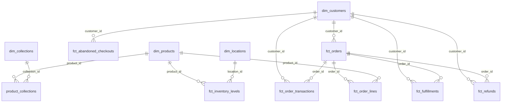

# marts テーブル (`marts` スキーマ)

分析・BI が参照する最終形。dbt materialized: **table**。命名: `dim_` / `fct_` / ブリッジ。

| テーブル | 種別 | 定義 |
|---|---|---|
| dim_customers | dim | [dim_customers.md](dim_customers.md) |
| dim_products | dim | [dim_products.md](dim_products.md) |
| dim_collections | dim | [dim_collections.md](dim_collections.md) |
| dim_locations | dim | [dim_locations.md](dim_locations.md) |
| product_collections | bridge | [product_collections.md](product_collections.md) |
| fct_orders | fct | [fct_orders.md](fct_orders.md) |
| fct_order_lines | fct | [fct_order_lines.md](fct_order_lines.md) |
| fct_refunds | fct | [fct_refunds.md](fct_refunds.md) |
| fct_fulfillments | fct | [fct_fulfillments.md](fct_fulfillments.md) |
| fct_order_transactions | fct | [fct_order_transactions.md](fct_order_transactions.md) |
| fct_inventory_levels | fct | [fct_inventory_levels.md](fct_inventory_levels.md) |
| fct_discount_performance | fct | [fct_discount_performance.md](fct_discount_performance.md) |
| fct_abandoned_checkouts | fct | [fct_abandoned_checkouts.md](fct_abandoned_checkouts.md) |

## ER 図

marts の dim (マスタ) と fct (イベント/明細)・bridge の結合関係。ラベルは結合キー列。



> カーソル記法: `||` = ちょうど1、`o{` = 0以上(多)。dim が親 (1)、fct/bridge が子 (多)。
>
> **`fct_discount_performance`** は上図に線を持たない独立ファクト。割引は注文に
> コード文字列 (`discountCodes`) として適用されるだけで直接の FK が無いため、
> 分析ではコード一致で `fct_orders` と突き合わせる (詳細は
> [fct_discount_performance.md](fct_discount_performance.md))。
>
> スター構成: 中心の `fct_orders` / `fct_order_lines` を `dim_customers` /
> `dim_products` / `dim_collections` / `dim_locations` が取り囲む。

## 分析クエリ例

```sql
-- 月次 純売上・粗利
select date_trunc('month', order_date) as month,
       sum(net_line_revenue) as revenue, sum(gross_margin) as margin
from marts.fct_order_lines group by 1 order by 1;

-- カテゴリ別売上
select pc.collection_title, sum(l.net_line_revenue) as revenue
from marts.fct_order_lines l
join marts.product_collections pc on l.product_id = pc.product_id
group by 1 order by revenue desc;

-- カゴ落ち復帰率
select count(*) as carts,
       sum(case when is_recovered then 1 else 0 end)::double / count(*) as recovery_rate
from marts.fct_abandoned_checkouts;
```
